# Latvijas augi

##### Autori: Kārlis Gustavs Ārītis, Niklāvs Bērziņš, Mārtiņš Bode, Rūdolfs Bogdanos, Uvis Olafs Briedis, Ēriks Dukaļskis, Andris Greitāns, Artūrs Patriks Griķis, Viestards Kalniņš, Ernests Kurmis, Roberts Kuzņecovs, Kristaps Kristers Lakševics, Andris Morozovs, Kārlis Pastors, Kristaps Plāte, Patriks Jānis Pudāns, Valts Putāns, Kārlis Aleksands Strante, Arts Stuberovskis

# Augu valsts

---

## Sēklaugu nodalījums

---

### Segsēkļu apakšnodalījums

---

#### Viendīgļlapju klase

---

##### Liliju dzimta

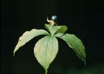{height=440px}

---

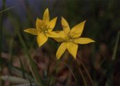{height=550px}

---

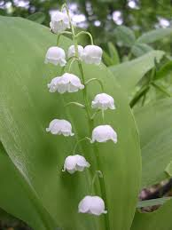{height=550px}

---

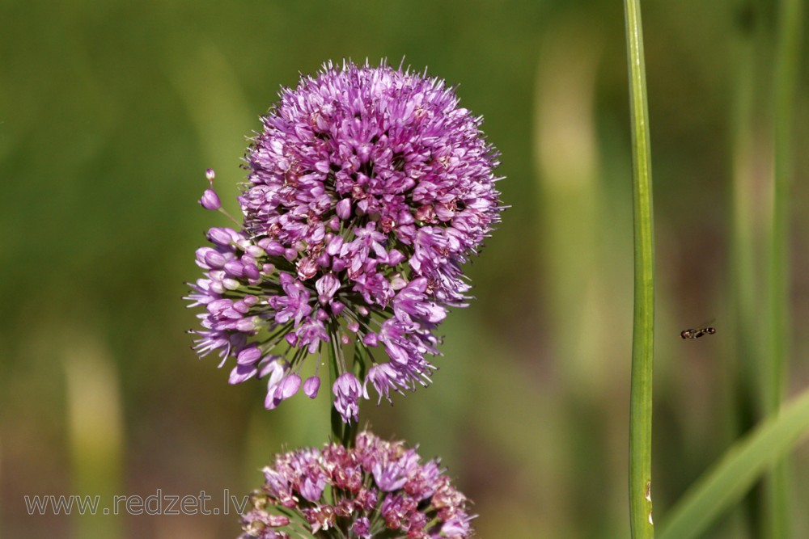{height=550px}

---

#### Divdīgļlapju klase

---

##### Magoņu dzimta

---

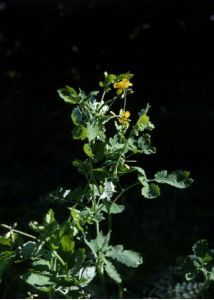{height=550px}

---

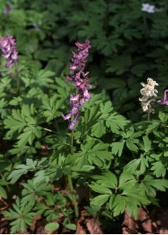{height=550px}

---

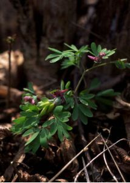{height=550px}

---

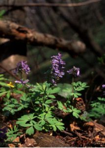{height=550px}

---

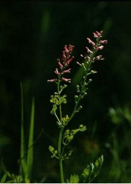{height=550px}

---

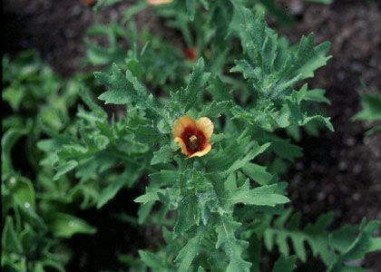{height=550px}

---

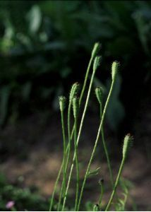{height=550px}

---

##### Nakteņu dzimta

---

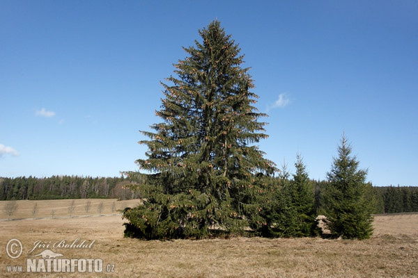

---

---

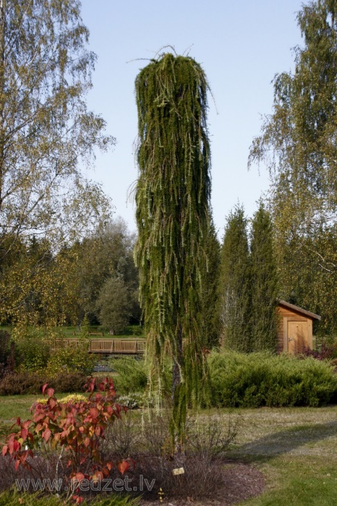

---

##### Cūknātru dzimta

---

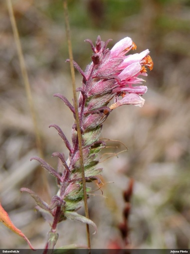{height=550px}

---

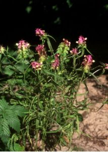{height=550px}

---

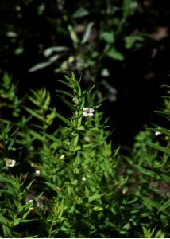{height=550px}

---

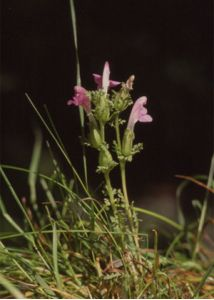{height=550px}

---

##### Graudzāļu dzimta

---

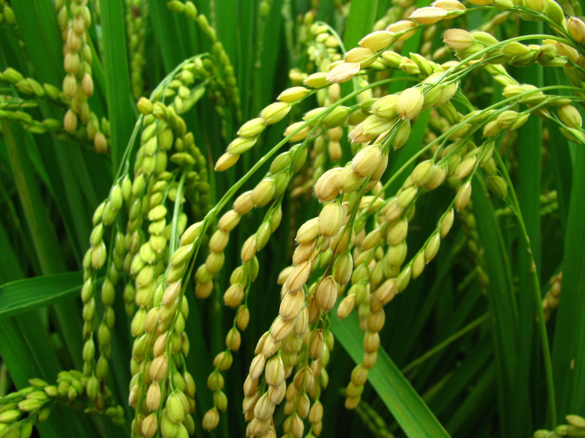{height=550px}

---

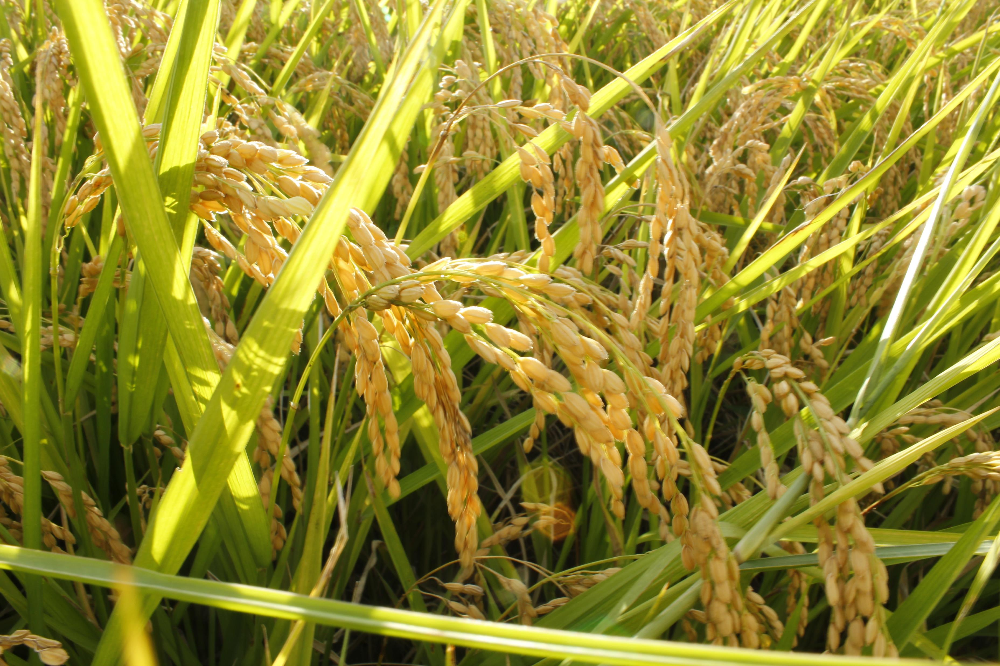{height=550px}

---

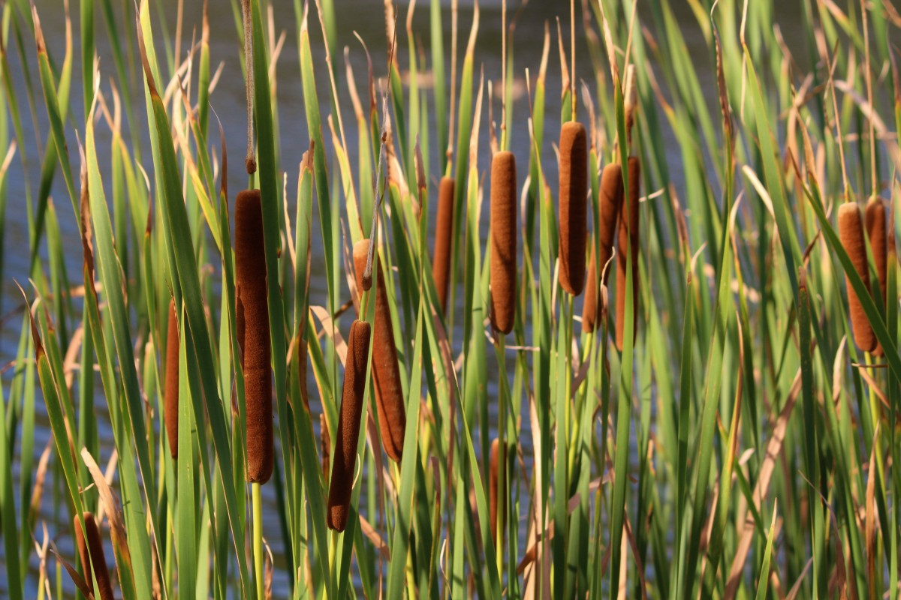{height=550px}

---

##### Kurvjziežu dzimta

---

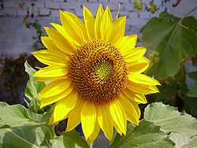{height=550px}

---

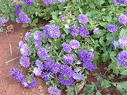{height=550px}

---

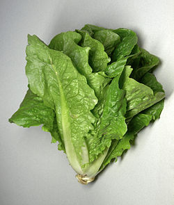{height=550px}

---

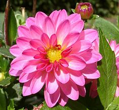{height=550px}

---

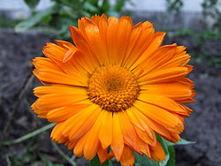{height=550px}

---

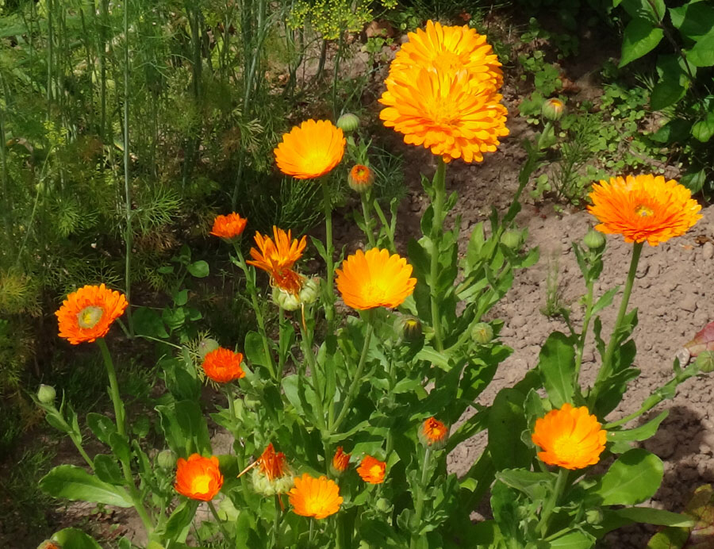{height=550px}&nbsp;

---

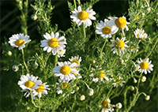{height=550px}

---

##### Rožu dzimta

---

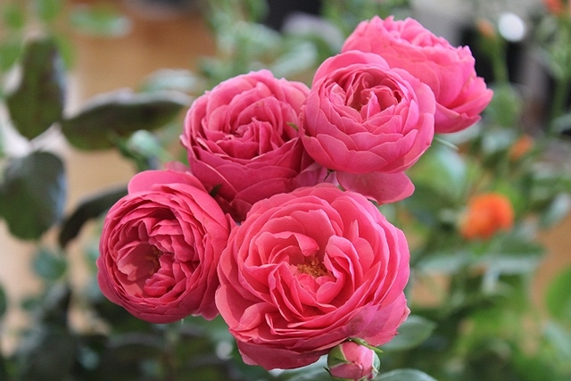{height=550px}\

---

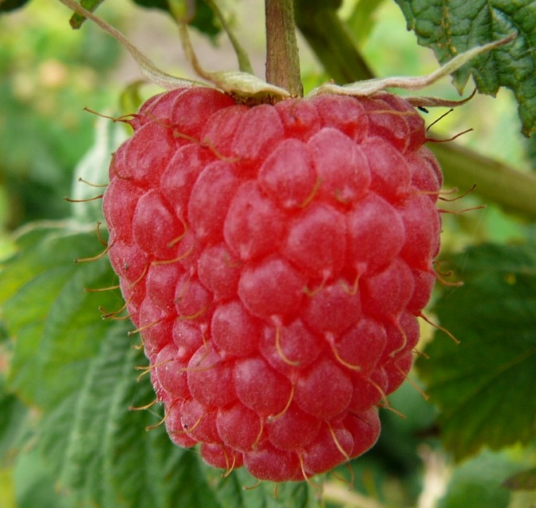{height=550px}\

---

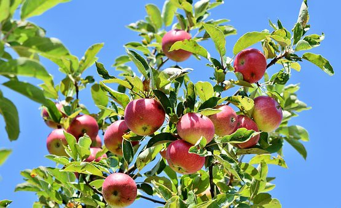{height=550px}&nbsp;

---

##### Krustziežu dzimta

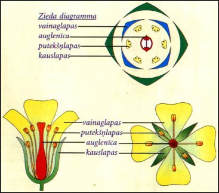{height=500px}\

---

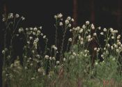{height=550px}

---

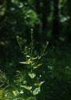{height=550px}

---

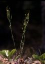{height=550px}

---

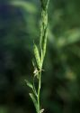{height=550px}

---

##### Rubiju dzimta

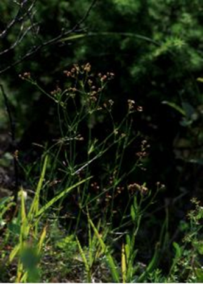{height=440px}

---

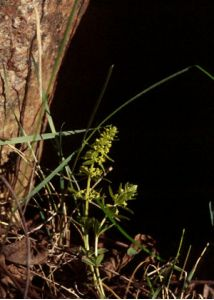{height=550px}

---

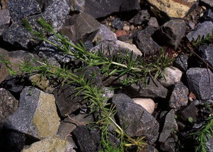{height=550px}

---

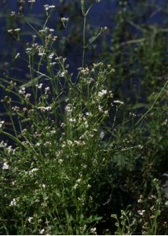{height=550px}

---

##### Vijolīšu dzimta

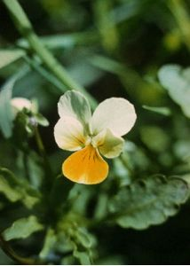{height=440px}

---

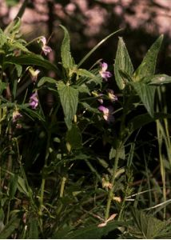{height=550px}

---

{height=550px}

---

### Kailsēkļu apakšnodalījums

---

#### Skujkoku klase

---

##### Ciprešu dzimta

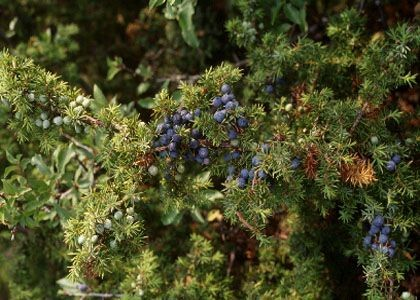{height=440px}

---

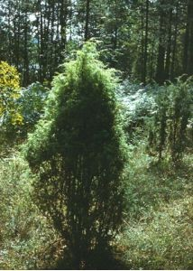{height=550px}\

---

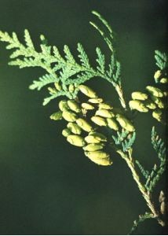{height=550px}

---

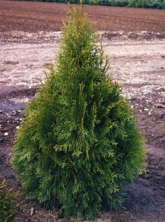{height=550px}\

---

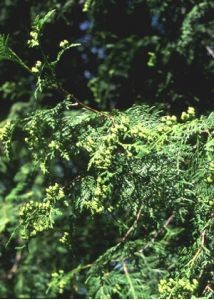{height=550px}\

---

##### Īvju dzimta

---

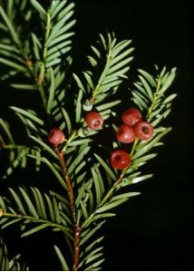{height=420px}

---

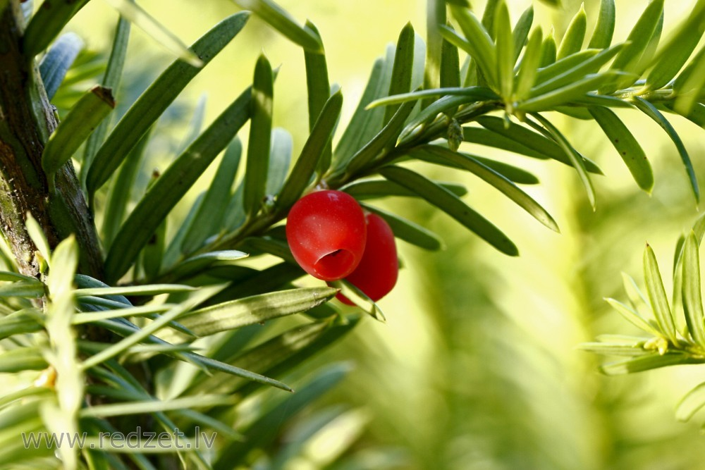{height=550px}&nbsp;

---

## Paparžaugu nodalījums

---

### Paparžu apakšnodalījums

---

#### Paparžu klase

---

##### Sīkpaparžu dzimta

---

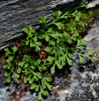{height=550px}

---

{height=550px}

---

##### Ēnpaparžu dzimta

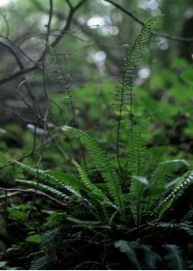

---

### Staipekņu apakšnodalījums

---

#### Staipekņu klase

---

##### Staipekņu dzimta

{height=440px}

---

##### Ezereņu dzimta

{height=440px}

---

##### Apdziru dzimta

{height=440px}

---

### Kosu apakšnodalījums

---

#### Kosu klase

---

##### Kosu dzimta

---

{height=550px}

---

{height=550px}

# Sēņu valsts

{height=440px}

---

{height=550px}
